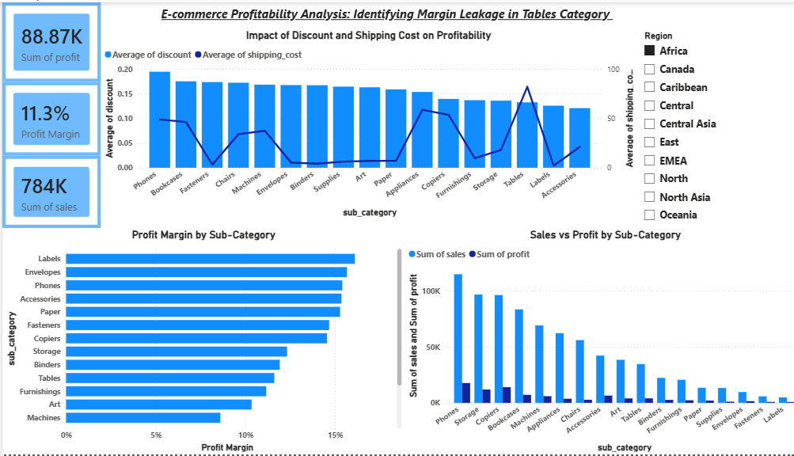

# 📊 E-Commerce Profitability Analysis

## 🔍 Overview
This project analyzes e-commerce sales data to identify key drivers of profitability and uncover margin leakage across product categories.

## 🎯 Objective
To evaluate sales, profit, and cost factors affecting business performance and provide actionable insights.

## 🛠 Tools Used
- Excel (Data Cleaning)
- Power BI (Dashboard & Visualization)

## 📈 Key Insights
- Tables category generates strong sales but low profitability
- High shipping costs significantly impact margins
- Profitability varies across sub-categories

## 💡 Recommendations
- Optimize shipping/logistics for bulky products like Tables
- Re-evaluate pricing and cost structure

## 📷 Dashboard Preview

## 🚀 Outcome
Developed an interactive dashboard to support data-driven decision-making and highlight areas of improvement.
